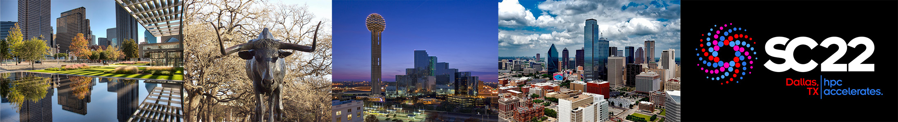

<h2>Correctness 2021: Fifth International Workshop on Software Correctness for HPC Applications</h2>

<h4> November 19, 2021 (half day, 8:30am - 12pm CST) </h4>

<h4> America’s Center Convention Complex </h4>

<h4> St. Louis, MO, USA </h4>

<h5> Held in conjunction with SC21: <a href="https://sc21.supercomputing.org/">The International Conference for High Performance Computing, Networking, Storage and Analysis</a> </h5>

In cooperation with  

----

Ensuring correctness in high-performance computing (HPC) applications is one of the fundamental challenges that the HPC community faces today. While significant advances in verification, testing, and debugging have been made to isolate software errors (or defects) in the context of non-HPC software, several factors make achieving correctness in HPC applications and systems much more challenging than in general systems software—growing heterogeneity (architectures with CPUs, GPUs, and special purpose accelerators), massive scale computations (very high degree of concurrency), use of combined parallel programing models (e.g., MPI+X), new scalable numerical algorithms (e.g., to leverage reduced precision in floating-point arithmetic), and aggressive compiler optimizations/transformations are some of the challenges that make correctness harder in HPC. The following report lays out the key challenges and research areas of HPC correctness: [DOE Report of the HPC Correctness Summit](https://www.osti.gov/biblio/1470989).

As the complexity of future architectures, algorithms, and applications in HPC increases, the ability to fully exploit exascale systems will be limited without correctness. With the continuous use of HPC software to advance scientific and technological capabilities, novel techniques and practical tools for software correctness in HPC are invaluable.

The goal of the Correctness Workshop is to bring together researchers and developers to present and discuss novel ideas to address the problem of correctness in HPC. The workshop will feature contributed papers and invited talks in this area.

----
### <a class="anchor" name="topics">Workshop Topics</a>

Topics of interest include, but are not limited to:

#### Correctness in Scientific Applications and Algorithms
* Formal methods and rigorous mathematical techniques for correctness in HPC applications
* Frameworks to address the challenges of testing complex HPC applications (e.g., multiphysics applications)
* Approaches for the specification of numerical algorithms with the goal of correctness checking
* Error identification in the design and implementation of numerical algorithms using finite-precision floating point numbers

#### Tools for Debugging, Testing, and Correctness Checking
* Program synthesis techniques for testing and debugging HPC applications
* Tools to control the effect of non-determinism when debugging and testing HPC software
* Scalable debugging solutions for large-scale HPC applications
* Scalable tools for model checking, verification, certification, or symbolic execution
* Static and dynamic analysis to test and check correctness in the entire HPC software ecosystem
* Predictive debugging and testing approaches to forecast the occurrence of errors in specific conditions
* Machine learning and anomaly detection for bug detection and localization

#### Programing Models and Runtime Systems Correctness
* Correctness in emerging HPC programing models
* Analysis of software error propagation and error handling in HPC runtime systems and libraries
* Metrics to measure the degree of correctness of HPC software
* Specifications to check the correctness of runtime systems

#### Other Areas
* Large databases of bug reports and/or reproducible test cases of HPC software
* Benchmarks to test the effectiveness of HPC correctness tools

----
### <a class="anchor" name="submissions"> Submissions and Format </a>

Authors are invited to submit manuscripts in English structured as technical or experience papers at a length of at least **6 pages** but not exceeding **8 pages** of content, including everything. Submissions must use the [IEEE format](https://www.ieee.org/conferences/publishing/templates.html).

Submitted papers will be peer-reviewed by the Program Committee and accepted papers will be published by IEEE Xplore via TCHPC.

Submitted papers must represent original unpublished research that is not currently under review for any other venue. Papers not following these guidelines will be rejected without review. Submissions received after the due date, exceeding length limit, or not appropriately structured may also not be considered. At least one author of an accepted paper must register for and attend the workshop. Authors may contact the workshop organizers for more information. Papers should be submitted electronically at: [https://submissions.supercomputing.org/](https://submissions.supercomputing.org/).

#### SC Reproducibility Initiative

We encourage authors to submit an **optional** artifact description (AD) appendix along with their paper, describing the details of their software environments and computational experiments to the extent that an independent person could replicate their results. The AD appendix is not included in the 8-page limit of the paper and should not exceed **2 pages** of content. For more details of the **SC Reproducibility Initiative** please see: [https://sc19.qltdclient.com/submit/reproducibility-initiative/](https://sc21.supercomputing.org/submit/reproducibility-initiative/).

---
###  <a class="anchor" name="proceedings"> Proceedings </a>

The proceedings will be archived in IEEE Xplore via [TCHPC](https://tc.computer.org/tchpc/).

---
### <a class="anchor" name="dates"> Important Dates </a>

Due to several requests, we have extended the submission deadline to Aug/16/21.

* Paper submissions due: ~~August 9, 2021~~ **Extended:** August 16, 2021
* Notification of acceptance: September 20, 2021
* E-copyright registration completed by authors: TBD
* Camera-ready papers due: TBD

All time zones are AOE.

---
### <a class="anchor" name="date">Workshop Date</a>

- Half-day Workshop
- November 19, 2021, 8:30am - 12pm CST

---
### <a class="anchor" name="org">Organizers</a>

[Ignacio Laguna](http://lagunaresearch.org/), LLNL  
[Cindy Rubio-González](http://web.cs.ucdavis.edu/~rubio/), UC Davis

---
### <a class="anchor" name="pc">Program Committee</a>

[Alper Altuntas](https://staff.ucar.edu/users/altuntas), National Center for Atmospheric Research, USA  
[Allison H. Baker](https://staff.ucar.edu/users/abaker), National Center for Atmospheric Research, USA  
[John Baugh](https://www.ccee.ncsu.edu/people/jwb/), North Carolina State University, USA  
[Hugo Brunie](https://team.inria.fr/corse/team-members/), INRIA, France  
[Patrick Carribault](http://www.cea.fr/), CEA-DAM, France   
[Charisee Chiw](https://galois.com/team/charisee-chiw/), Galois, Inc, USA  
[Ganesh Gopalakrishnan](https://www.cs.utah.edu/~ganesh/), University of Utah, USA  
[Geoffrey C. Hulette]( http://www.sandia.gov/), Sandia National Laboratories, USA   
[Michael O. Lam](https://w3.cs.jmu.edu/lam2mo/), James Madison University, USA  
[Jackson Mayo](http://www.sandia.gov/), Sandia National Laboratories, USA  
[Boyana Norris](https://ix.cs.uoregon.edu/~norris/), University of Oregon, USA  
[Joachim Protze](https://www.itc.rwth-aachen.de/cms/IT-Center/IT-Center/Team/~oobd/Joachim-Protze/lidx/1/), RWTH Aachen University, Germany  
[Tristan Ravitch](https://galois.com/team/tristan-ravitch/), Galois, Inc, USA  
[Emmanuelle Saillard](http://emmanuellesaillard.fr/), INRIA Bordeaux, France   
[Markus Schordan]( https://people.llnl.gov/schordan1), Lawrence Livermore National Laboratory, USA  
[Tristan Vanderbruggen](https://people.llnl.gov/vanderbrugge1), Lawrence Livermore National Laboratory, USA  

---
### <a class="anchor" name="venue">Venue</a>

- America’s Center Convention Complex, St. Louis, MO, USA
- Room: TBD

---
### <a class="anchor" name="program">Program</a>
 

###### Session 1
<table>
<tr><td width="15">  </td> <td>8:30am - 8:40pm:  Opening remarks    </td> </tr>
<tr><td width="15">  </td> <td>8:40am - 9:00am:  Invited Paper 1:  <b>"Finding Large Poisson Polynomials Using Four-Level Variable Precision"</b>, David H. Bailey </td> </tr>
<tr><td width="15">  </td> <td>9:00am - 9:20am:  Paper 1: <b>"Guarding Numerics Amidst Rising Heterogeneity"</b>, Ganesh Gopalakrishnan, Ignacio Laguna, Ang Li, Pavel Panchekha, Cindy Rubio-González, Zachary Tatlock </td> </tr>
<tr><td width="15">  </td> <td>9:20am - 9:40am:  Paper 2: <b>"The MPI BUGS INITIATIVE: a Framework for MPI Verification Tools Evaluation"</b>, Mathieu Laurent, Emmanuelle Saillard, Martin Quinson </td> </tr>
<tr><td width="15">  </td> <td>9:40am - 10:00am:  Invited Paper 2: <b>"OpenRace: An Open Source Framework for Statically Detecting Data Races"</b>, Bradley Swain, Jeff Huang, Bozhen Liu, Peiming Liu, Yanze Li,  Addison Crump, Rohan Khera  </td> </tr>
</table>

###### Break
<table>
<tr><td width="15">  </td> <td> 10:00am - 10:30am:  Break </td> </tr>
</table>

###### Session 2
<table>
<tr><td width="15">  </td> <td>10:30am - 10:50am:  Paper 3: <b>"Performance of Dynamic Data Race Detection"</b>, Joachim Protze, Isabel Thärigen,  Jonas Wahle </td> </tr>
<tr><td width="15">  </td> <td>10:50am - 11:10am:  Paper 4: <b>"High-Precision Evaluation of Both Static and Dynamic Tools using DataRaceBench"</b>, Pei-Hung Lin, Chunhua Liao </td> </tr>
<tr><td width="15">  </td> <td>11:10am - 12:00pm:  Plenary Session: "Building a Bug Hunting Competition for HPC Correctness", Cindy Rubio-González (UC Davis),  Martin Quinson (ENS Rennes), Chunhua Liao (LLNL), Joachim Protze (RWTH Aachen University), Markus Schordan (LLNL) </td> </tr>
</table>

#### Building a Bug Hunting Competition for HPC Correctness
Why the competition? The goal of the competition is to stimulate the development of correctness tools and the improvement of existing ones in the domain of HPC. As HPC applications become more complex and heterogeneous, we would like to discuss as a community: (1) potential benchmark suites for correctness tools, (2) metrics and criteria for comparing tools, (3) databases of bug reports and/or reproducible test cases, (4) defining the competition rules, and (5) important classes of bugs or correctness issues to address. The section 5.4 of the DOE Report of the HPC Correctness Summit highlights some of the benefits for such competitions: https://www.osti.gov/biblio/1470989.

---
###  <a class="anchor" name="contact">Contact Information</a>
Please address workshop questions to Ignacio Laguna (ilaguna@llnl.gov) and/or Cindy Rubio-González (crubio@ucdavis.edu).

---
### <a class="anchor" name="previous">Previous Workshops</a>
- [Correctness 2020](https://correctness-workshop.github.io/2020/)
- [Correctness 2019](https://correctness-workshop.github.io/2019/)
- [Correctness 2018](https://correctness-workshop.github.io/2018/)
- [Correctness 2017](https://correctness-workshop.github.io/2017/)

